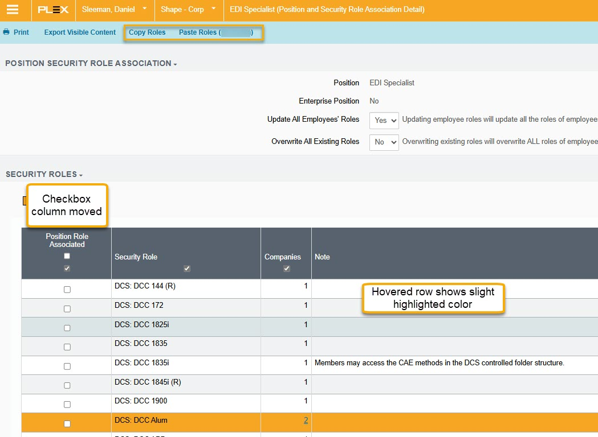

# PMC Expanded

This addon is a collection of tweaks and QOL improvements I've made over my years of working with the Plex Manufacturing Cloud systems.

This addon has features for both Classic and UX environments.  
I have been slowly working to migrate my classic features to UX.

- [PMC Expanded](#pmc-expanded)
- [Installation](#installation)
  - [Loading as an unpacked extension](#loading-as-an-unpacked-extension)
  - [Building From Source](#building-from-source)
- [General Features](#general-features)
    - [Role Copy/Paste Buttons](#role-copypaste-buttons)
- [UX Features](#ux-features)
    - [No Lazy Loading](#no-lazy-loading)
    - [Export Anywhere](#export-anywhere)
    - [Enterprise Enabled Security Roles](#enterprise-enabled-security-roles)
    - [Security Manager Action Keys](#security-manager-action-keys)
    - [Checklist edit link](#checklist-edit-link)
    - [Checksheet Fill](#checksheet-fill)
    - [Compare Settings](#compare-settings)
    - [EDI Log Buttons](#edi-log-buttons)
    - [Favorites F-Key Unlock](#favorites-f-key-unlock)
    - [SQL Development Environment F5 to Execute](#sql-development-environment-f5-to-execute)
    - [Label Designer](#label-designer)
    - [Search Filter Pin Default](#search-filter-pin-default)
    - [Project management checklist link](#project-management-checklist-link)
    - [Role Manager Action Keys](#role-manager-action-keys)
    - [Position Role Association](#position-role-association)
    - [User Manager Buttons](#user-manager-buttons)
    - [Role Revision History](#role-revision-history)
- [Classic Features](#classic-features)
    - [Calendar Mass Update](#calendar-mass-update)
    - [Checklist Edit Links](#checklist-edit-links)
    - [Checksheet Populate](#checksheet-populate)
    - [Customer PO Buttons](#customer-po-buttons)
    - [EDI Log Buttons](#edi-log-buttons-1)
    - [Escape Override](#escape-override)
    - [Label Designer Buttons](#label-designer-buttons)
    - [Renault Delfor Button](#renault-delfor-button)
    - [User Manager](#user-manager)
    - [VP Tab Index Fix](#vp-tab-index-fix)

# Installation

Chrome Addon Store: [Link to be determined]('')

Edge Addon Store: [Link to be determined]('')

## Loading as an unpacked extension

* Download the latest release zip file
* Unzip to a folder
* Enable developer mode on your chromium browser of choice.
* Load this directory as an unpacked extension.

Alternatively:
* Clone the repo.
* Load this directory as an unpacked extension.

## Building From Source

Requirements
* terser
* python
  * htmlmin
  * rcssmin

To build, clone the repo and run:

```bash
python build.py
```
This will package the required files into a zip file.

# General Features

### Role Copy/Paste Buttons

On various screens for managing roles, there are options to add copy and paste buttons.

These share functionality and logic between eachother.

* Copy
    * Copies all the enabled roles into a local storage variable
* Paste
    * Only *adds* roles from the copied list. Does not remove any roles.
    * The paste button will show a reference to the place that was used for copying.
        * E.G. username, position, full name

The paste action looks at the setting for excluded role terms and does not paste any roles even if they are in the copied list.


# UX Features

### No Lazy Loading

<details>
<summary>Reference Files</summary>

`background.js`  
`config.js`

</details>

This creates a dynamic declarativeNetRequest rule which adds the URL query param of `__features=novirtual` if it is not already present.

The UX Grid constructor has code which looks for the `__features` query param and adds the value to the `env.features` variable on initialization.  
The constructor checks for `env.features.novirtual == 1` to determine whether or not to configure lazy loading on the grid.  
Adding `novirtual` will force all UX grids to never implement lazy loading.

This filter is required for a few of the other content scripts to behave as expected.  
For example, the Position Role Association column rearrange will have the column width reverted when a lazy load is triggered. Unsure how to handle this, but the actual data is still in the right spot. I believe it is because the headers never revert position, but they do update the width on lazy loading.

This will increase load times on certain screens, but I find that this is a very acceptable tradeoff to not having to wait for each lazy load chunk to render. (300 rows if i recall correctly).  
This also allows for browser ctrl+f searching properly instead of the janky Plex implementation.

### Export Anywhere

<details>
<summary>Reference Files</summary>

`ux\UX-Export-Anywhere.js`  
`ux\src\UX-Export-Anywhere-Script.js`
</details>

Adds a button to export the _visible_ text from any grid.

This is a bit janky and doesn't work well on screens with multiple grid elements.


### Enterprise Enabled Security Roles

<details>
<summary>Reference Files</summary>

`ux\UX-Enterprise-Roles.js`  
`ux\src\UX-Enterprise-Roles-Script.js`
</details>

Adds a button to populate the enterprise role popup window with the current role name for the defined PCNs.

PCN list can be maintained in the extension settings. Use `_ALL_` to paste for every PCN in the list.


### Security Manager Action Keys

<details>
<summary>Reference Files</summary>

`ux\UX-Security-Manager-Action-Keys.js`  
`ux\src\UX-Security-Manager-Action-Keys-Script.js`
</details>

Adds an action bar button to the page which adds the action keys under the displayed action.

This is useful for determining which action key is required for creating navigation links in custom VP reports.

### Checklist edit link
<details>
<summary>Reference Files</summary>

`ux\UX-Checklist-Edit-Link.js`
</details>

Adds action button to the "grid view" of a checklist that allows for editing the checklist details.  
I use this to enable "N/A" support since UX does not enable this by default like classic.

### Checksheet Fill

<details>
<summary>Reference Files</summary>

`ux\UX-Checksheet-Fill-Script.js`
</details>

**Not currently implemented**

Intended to be a button that can fill out an entire production checksheet. It doesn't work in UX at this time. This is only intended to be used for testing purposes.

### Compare Settings
<details>
<summary>Reference Files</summary>

`ux\UX-Compare-Settings.js`
</details>

Adds a button on the dropdown gears which opens the settings compare screen. This is normally only accessible when on the settings manager screen.  
Used to be a navigatable screen in classic.


### EDI Log Buttons
<details>
<summary>Reference Files</summary>

`ux\UX-EDI-Log-Buttons.js`
</details>

Adds buttons to the EDI log screen
* Process ASN - Access the ASN Processing screen to view/trigger drop-ship automation ASNs
* EDI Mailboxes - Access the EDI Mailboxes screen

### Favorites F-Key Unlock
<details>
<summary>Reference Files</summary>

`ux\src\UX-Favorites-Unlock-Script.js`  
`ux\UX-Favorites-Unlock.js`
</details>

This overrides the restriction UX places upon favorite F-keys that classic did not have.  
Setting a favorite to a browser reserved F-key will override the browser's native function.  
UX does not allow this by default, but there was a time when it did and they have not removed the hotkey functionality for users who had set these at that time.

This script removes and replaces the available options in the F-key drop down selector when loaded.

F5 is still restricted in order to replicate the classic behavor as well as allow for SQL development environment useage without conflicts.


### SQL Development Environment F5 to Execute
<details>
<summary>Reference Files</summary>

`ux\src\UX-SQL-Development-F5-Script.js`  
`ux\UX-SQL-Development-F5.js`
</details>

Allows to use the F5 key to execute a SQL query.  
This was behavior available in the classic version if using the Cumulus plugin.

Most IDEs allow F5 execution, and there is nothing worse than Plex completely erasing your SQL work when you press F5 instead of moving your hand to your mouse to click on a button.

### Label Designer
<details>
<summary>Reference Files</summary>

`ux\UX-Label-Designer-Button.js`  
`ux\UX-Label-Links.js`
</details>

Adds action bar button to navigate to the "label testing" screen from the label designer element grid.  
This is currently only available on the label library screen.

Adds hyperlinks to the label elements grid to edit that row's element.  
Behaves like the "pencil" icon in classic.  
Same functionality as highlighting a row and clicking the edit button on the action bar just with fewer clicks.

2/21/2025 - Links seem broken. The links show and then get removed immediately.


### Search Filter Pin Default
<details>
<summary>Reference Files</summary>

`ux\UX-Pin-Default.js`  
`ux\src\UX-Pin-Default-Script.js`
</details>

Sets the "pin filters" pin to always true.  
This prevents the search filters from being hidden automatically.  

This prevents the user from manually toggling the pin.  
You can still manually hide filters with the link which will not affect this behavior since the pin is unloaded at this point.

### Project management checklist link
<details>
<summary>Reference Files</summary>

`ux\UX-Project-Management-Checklist-Link.js`
</details>

Adds a link to the full checklist from the project manager > step overview screen.

This is not otherwise accessible and you would need to go to the checklists screen to access this info.  
The project management screen only allows checklist sections to be opened via the "Checklist" button.


### Role Manager Action Keys
<details>
<summary>Reference Files</summary>

`ux\src\UX-Role-Manager-Action-Keys-Script.js`  
`ux\UX-Role-Manager-Action-Keys.js` 
</details>

Adds action keys to the grid for the security roles manager.

These are needed for VP screen navigation.


### Position Role Association
<details>
<summary>Reference Files</summary>

`ux\UX-Position-Role-Association-Rearrange.js`  
`ux\src\UX-Position-Role-Association-Rearrange-Script.js`  
`ux\UX-Position-Role-Association-Highlight.css`  
`ux\UX-Position-Role-Association-Buttons.js`
</details>

Multiple features for this screen

* Rearrange the columns to have the checkboxes in the first position.
* Custom css which highlights the row you are hovering over.
* Adds buttons to the screen 
    * Copy Roles - Add the currently selected roles to local storage variable
        * Copy roles can also be used from the grid when searching a specific role without needing to open the detail screen.
    * Paste Roles - Select all the local storage variable's roles. Does not remove any pre-existing roles.



### User Manager Buttons
<details>
<summary>Reference Files</summary>

`ux\UX-User-Manager-Role-Buttons.js`
</details>

Adds buttons to the user manager screen.
* Copy Roles- Add the currently selected roles to local storage variable
* Paste Roles - Select all the local storage variable's roles. Does not remove any pre-existing roles
* Select All Admin - Selects the "admin" checkbox for every role. This is needed for anyone administering security.

The Admin checkbox is important for UX functionality due to the way the Position Role Association screen behaves differently than classic.

In Classic, if a user does not have admin to a role and makes updates to a position association which has that role, it will remain on the position.  
In UX, this role will be removed from the position association.


### Role Revision History
<details>
<summary>Reference Files</summary>

`ux\UX-Role-History-Buttons.js`  
`ux\src\UX-Role-History-Buttons-Script.js`
</details>

Adds a number of features to this screen.

* Button to copy the "Remove" type records in the search results.
    * This allows for pasting these roles back into a user record or position role association.
* Button to copy the "Added" type records in the search results.
* Button to filter to only UX roles
* Button to filter to only classic roles

This copy ability is likely unique to Shape's use-case. They are using a specific Plex sproc for security integration with ADP which does not properly deal with manual roles outside of postions or "additional positions" security roles.

The sproc is removing any access that is not directly assigned to the person's position role association.  
The expected behavior is to keep anything manual, as well as any additional position role association.

By filtering for a certain date and user, you can copy all the entries removed by integration for easy re-adding.

# Classic Features

### Calendar Mass Update
<details>
<summary>Reference Files</summary>

`classic\Plex-Calendar-Year-Expander.js`
</details>

**This can be done in UX natively.**

Injects options to the shipping calendar mass update drop-downs that allow for cleaning up past records.  

Why would you need this?  
If any date on a shipping calendar is defined as shipable, then every other day is considered non-shippable. If no days are shippable, every day is considered shippable.  
This allows you to remove every single old shipping day if you no longer wish to maintain the shipping calendar.

### Checklist Edit Links
<details>
<summary>Reference Files</summary>

`classic\Checklist-Edit-Link.js`
</details>

Adds buttons to the checklist details to allow you to edit the actual checklist for enabling 'n/a' or changing the checklist title.

### Checksheet Populate
<details>
<summary>Reference Files</summary>

`classic\Checksheet-Populate.js`
</details>

Adds a button to control panel checksheets which pencil whips them.  

There is a flaw in the design of the classic screen which does not validate the data entered into these fields when submitting the completed checksheet.

Content validation relies on the `onblur()` event to validate for pass/fail conditions. When submitting the checksheet, it assumes these values would have been validated already.

This script exploits this by setting the value of all text/number inputs to 0 which is accepted as long as they are not focused/blured.

It also selects all the 'pass' radio buttons even if the positions are randomized.

___This is only intended for testing purposes when there are ridiculous amounts of control plan checks and you don't want to remove the control plan from the part entirely.___

### Customer PO Buttons
<details>
<summary>Reference Files</summary>

`classic\Customer-PO-Buttons.js`
</details>

Adds buttons to the customer PO grid to access the upload screen.

**This is native functionality in UX.**

### EDI Log Buttons
<details>
<summary>Reference Files</summary>

`classic\EDI-Log-Buttons.js`
</details>

Adds buttons to the EDI log 
* Upload - Access the EDI upload screen
* Process ASN - Access the ASN Processing screen to trigger drop-ship automation ASNs
* EDI Mailboxes - Access the EDI Mailboxes screen

**The upload button is native functionality in UX.**


### Escape Override
<details>
<summary>Reference Files</summary>

`classic\Plex-Esc-Override-Script.js`
</details>

This overrides the "browser back" mouse button to send an "Escape" instead. 

In classic, the normal browser back functionality will break breadcrumb trails, so escape should be used instead.

### Label Designer Buttons
<details>
<summary>Reference Files</summary>

`classic\Label-Designer-Button.js`
</details>

Adds a "get serial" button to the label designer element editor. 

Normally only exists in the label library. 

This screen allows you to test print labels using specific serial numbers rather than the default serial when printing a sample from the label designer.

### Renault Delfor Button
<details>
<summary>Reference Files</summary>

`classic\Renault-DELFOR-Button.js`
</details>

**Specific to Shape Corp.**

Adds a button on the customer VP screen for Renault DELFOR splitting to open the DCS folder where these files are stored.

This is natively available to be added in the UX VP designer.

### User Manager
<details>
<summary>Reference Files</summary>

`classic\User-Manager-Buttons.js`
</details>

Adds buttons to the user manager screen.
* Copy Roles
    * Add the currently selected roles to local storage variable
* Paste Roles 
    * Select all the local storage variable's roles. Only roles starting with the "UX prefix" setting value.
* Paste Classic Roles 
    * Select all the local storage variable's roles. Pastes every matching non-UX role.
* Select All Admin 
    * Selects the "admin" checkbox for every role. This is needed for anyone administering security.


### VP Tab Index Fix
<details>
<summary>Reference Files</summary>

`classic\VP-Tab-Index-Fix.js`
</details>

Assigns all VisionPlex report filter elements to the same tab index.

Some Plex created VP screen filters have a 0 tab index which causes you to have to tab through most of the screen elements before going to the second filter.

This sets all of them to index 1.