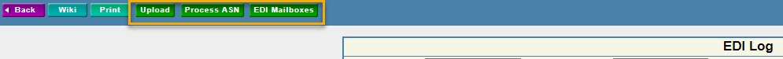

# PMC Expanded

This addon is a collection of tweaks and QOL improvements I've made over my years of working with the Plex Manufacturing Cloud systems.

This addon has features for both Classic and UX environments.  
I have been slowly working to migrate my classic features to UX.

- [PMC Expanded](#pmc-expanded)
- [UX Features](#ux-features)
    - [No Lazy Loading](#no-lazy-loading)
    - [Export Anywhere](#export-anywhere)
    - [Security Manager Action Keys](#security-manager-action-keys)
    - [Checklist edit link](#checklist-edit-link)
    - [Checksheet Fill](#checksheet-fill)
    - [Compare Settings](#compare-settings)
    - [EDI Log Buttons](#edi-log-buttons)
    - [Favorites F-Key Unlock](#favorites-f-key-unlock)
    - [SQL Development Environment F5 to Execute](#sql-development-environment-f5-to-execute)
    - [Label Designer](#label-designer)
    - [Search Filter Pin Default](#search-filter-pin-default)
    - [Project management checklist link](#project-management-checklist-link)
    - [Role Manager Action Keys](#role-manager-action-keys)
    - [Position Role Association](#position-role-association)
    - [User Manager Buttons](#user-manager-buttons)
    - [User Manager Revision History](#user-manager-revision-history)
    - [Role Revision History](#role-revision-history)
- [Classic Features](#classic-features)
    - [Calendar Mass Update](#calendar-mass-update)
    - [Checklist Edit Links](#checklist-edit-links)
    - [Checksheet Populate](#checksheet-populate)
    - [Customer PO Buttons](#customer-po-buttons)
    - [EDI Log Buttons](#edi-log-buttons-1)
    - [Escape Override](#escape-override)
    - [Label Designer Buttons](#label-designer-buttons)
    - [Label Designer Links](#label-designer-links)
    - [Renault Delfor Button](#renault-delfor-button)
    - [User Manager](#user-manager)
    - [VP Tab Index Fix](#vp-tab-index-fix)

# UX Features

TODO - 1/10/2024 - Create links for the user manager "customer access" portion which links to that user's detail screen in the relevant PCN

`https://cloud.plex.com/Security/UserManagement/ViewUserManagerCustomerForm?__sk=21&__sak=81&__actionKey=10473&__asid=QUPRux4BrXTwENpMFzem&UserValue=2528250&UserCustomerKey=1100333&__features=novirtual`  
`https://cloud.plex.com/Security/UserManagement/ViewUserManagerCustomerForm?__sk=21&__sak=81&__actionKey=10473&__asid=Ud8py6ZDapYhPiAVY2uW&UserValue=2528250&UserCustomerKey=6348365&__features=novirtual`

__sk and __sak appear to be different for different submenus in the user manager. These are consistent from user to user and PCN to PCN.  
UserValue is the same. This is the PUN  
UserCustomerKey is different based on the PCN that is selected. Need to figure out if this is available on the screen or not.

datasource.raw is an array of each row which has a lot of detail. Does not have the usercustomerkey though.  
This same detail is avaialable on each checkbox data as well.

### No Lazy Loading

`background.js`

This creates a dynamic declarativeNetRequest rule which adds the URL query param of `__features=novirtual` if it is not already present.

The UX Grid constructor has code which looks for the `__features` query param and adds the value to the `env.features` variable on initialization.  
The constructor checks for `env.features.novirtual == 1` to determine whether or not to configure lazy loading on the grid.  
Adding `novirtual` will force all UX grids to never implement lazy loading.

This filter is required for a few of the other content scripts to behave as expected.  
For example, the Position Role Association column rearrange will have the column width reverted when a lazy load is triggered. Unsure how to handle this, but the actual data is still in the right spot. I believe it is because the headers never revert position, but they do update the width on lazy loading.

This will increase load times on certain screens, but I find that this is a very acceptable tradeoff to not having to wait for each lazy load chunk to render. (300 rows if i recall correctly).  
This also allows for browser ctrl+f searching properly instead of the janky Plex implementation.

### Export Anywhere

Adds a button to export the _visible_ text from any grid.

This is a bit janky and doesn't work well on screens with multiple grid elements.

### Security Manager Action Keys

`UX-Security-Manager-Action-Keys.js` `UX-Security-Manager-Action-Keys-Script.js`

Adds an action bar button to the page which adds the action keys under the displayed action.

This is useful for determining which action key is required for creating navigation links in custom VP reports.

### Checklist edit link

`UX-Checklist-Edit-Link.js`

Adds action button to the "grid view" of a checklist that allows for editing the checklist details.  
I use this to enable "N/A" support since UX does not enable this by default like classic.

### Checksheet Fill

`UX-Checksheet-Fill.js` `UX-Checksheet-Fill-Script.js`

TODO - 1/2/2024 - Make this function like the classic version. Need to use mutators to detect if the checksheet window is loaded.

Intended to be a button that can fill out an entire production checksheet. It doesn't work in UX at this time. This is only intended to be used for testing purposes.

### Compare Settings

`UX-Compare-Settings.js`

Adds a button on the dropdown gears which opens the settings compare screen. This is normally only accessible when on the settings manager screen.  
Used to be a navigatable screen in classic.

TODO - 1/2/2024 - Doesn't always work. Need a more consistent approach.

### EDI Log Buttons

`UX-EDI-Log-Buttons.js`

Adds buttons to the EDI log screen
* Process ASN - Access the ASN Processing screen to view/trigger drop-ship automation ASNs
* EDI Mailboxes - Access the EDI Mailboxes screen

### Favorites F-Key Unlock

`UX-Favorites-Unlock-Script.js` `UX-Favorites-Unlock.js`

This overrides the restriction UX places upon favorite F-keys that classic did not have.  
Setting a favorite to a browser reserved F-key will override the browser's native function.  
UX does not allow this by default, but there was a time when it did and they have not removed the hotkey functionality for users who had set these at that time.

This script removes and replaces the available options in the F-key drop down selector when loaded.

F5 is still restricted in order to replicate the classic behavor as well as allow for SQL development environment useage without conflicts.

### SQL Development Environment F5 to Execute

Allows to use the F5 key to execute a SQL query.  
This was behavior available in the classic version if using the Cumulus plugin.

Most IDEs allow F5 execution, and there is nothing worse than Plex completely erasing your SQL work when you press F5 instead of moving your hand to your mouse to click on a button.

### Label Designer

`UX-Label-Designer-Button.js`

Adds action bar button to navigate to the "label testing" screen from the label designer element grid.  
This is currently only available on the label library screen.

`UX-Label-Links.js`

2/21/2025 - Seems broken. The links show and then get removed immediately.

Adds hyperlinks to the label elements grid to edit that row's element.  
Behaves like the "pencil" icon in classic.  
Same functionality as highlighting a row and clicking the edit button on the action bar just with fewer clicks.

### Search Filter Pin Default

`UX-Pin-Default.js` `UX-Pin-Default-Script.js`

Sets the "pin filters" pin to always true.  
This prevents the search filters from being hidden automatically.  
You can still manually hide filters which will not affect this behavior since the pin is unloaded at this point.

### Project management checklist link

`UX-Project-Management-Checklist-Link.js`

Adds a link to the full checklist from the project manager > step overview screen.

This is not otherwise accessible and you would need to go to the checklists screen to access this info.  
The project management screen only allows checklist sections to be opened via the "Checklist" button.

### Role Manager Action Keys

`UX-Role-Manager-Action-Keys-Script.js` `UX-Role-Manager-Action-Keys.js` 

Adds action keys to the grid for the security roles manager. These are needed for VP screen navigation.

### Position Role Association

`UX-Position-Role-Association-Rearrange.js`  
`UX-Position-Role-Association-Rearrange-Script.js`  
`UX-Position-Role-Association-Highlight.css`  
`UX-Position-Role-Association-Buttons.js`

Script will rearrange the columns to have the checkboxes in the first position.

Custom css which highlights the row you are hovering over. Replicates the behavior in classic.  
This was something to help with checking the correct boxes before I figured out a way to rearrange them consistently.

Adds buttons to the screen 
* Copy Roles - Add the currently selected roles to local storage variable
* Paste Roles - Select all the local storage variable's roles. Does not remove any pre-existing roles.

### User Manager Buttons

`UX-User-Manager-Role-Buttons.js`

Adds buttons to the user manager screen.
* Copy Roles- Add the currently selected roles to local storage variable
* Paste Roles - Select all the local storage variable's roles. Does not remove any pre-existing roles
* Select All Admin - Selects the "admin" checkbox for every role. This is needed for anyone administering security.

The Admin checkbox is important for UX functionality due to the way the Position Role Association screen behaves differently than classic.

In Classic, if a user does not have admin to a role and makes updates to a position association which has that role, it will remain on the position.  
In UX, this role will be removed from the position association.

### User Manager Revision History

`UX-User-Manage-Revision-History-Cleanup.js`

Intended to clean up the ADP integration revision history garbage.

I think that the integrators are not making the proper revision change entries, so there are many garbage records being made. This may only be applicable to Shape or others using the same MFGx ADP integration.

TODO - 1/2/2024 - Figure out a way to identify all of the duplicates and remove these. 
For instance, if "Original Value" has a record with a matching "New Value" then remove all rows with a matching "Original Value" entry.
This would allow for cleaning up all the entries which have not actually changed.
The grouping would need to be done by the "Modified Date" column grouping.

### Role Revision History

`UX-Role-History-Buttons.js` `UX-Role-History-Buttons-Script.js`

Adds a button to copy the "Remove" type records in the search results.

This allows for pasting these roles back into a user record or position role association.

This is likely unique to Shape's use-case. They are using a specific Plex sproc for security integration with ADP which does not properly deal with manual roles outside of postions or "additional positions" security roles.

The sproc is removing any access that is not directly assigned to the person's position role association.  
The expected behavior is to keep anything manual, as well as any additional position role association.

# Classic Features

### Calendar Mass Update

`Plex-Calendar-Year-Expander.js`

Injects options to the shipping calendar mass update drop-downs that allow for cleaning up past records.  
This can be done in UX natively.

Why would you need this?  
If any date on a shipping calendar is defined as shipable, then every other day is considered non-shippable. If no days are shippable, every day is considered shippable.  
This allows you to remove every single old shipping day if you no longer wish to maintain the shipping calendar.

### Checklist Edit Links

`Checklist-Edit-Link.js`

Adds buttons to the checklist details to allow you to edit the actual checklist for enabling 'n/a' or changing the checklist title.

### Checksheet Populate

`Checksheet-Populate.js`

Adds a button to control panel checksheets which pencil whips them.  

There is a flaw in the design of the classic screen which does not validate the data entered into these fields when submitting the completed checksheet.  
Validation relies on the `onblur()` event to validate for pass/fail conditions. When submitting, it assumes these values would have been validated already.  
This script exploits this by setting the value of all text/number inputs to 0 which is accepted as long as they are not focused/blured.

It also selects all the 'pass' radio buttons even if the positions are randomized.

___This is only intended for testing purposes when there are ridiculous amounts of control plan checks and you don't want to remove the control plan  from the part entirely.___

### Customer PO Buttons

`Customer-PO-Buttons.js`

Adds buttons to the customer PO grid to access the upload screen.

This is native functionality in UX.

### EDI Log Buttons

`EDI-Log-Buttons.js`

Adds buttons to the EDI log 
* Upload - Access the EDI upload screen
* Process ASN - Access the ASN Processing screen to trigger drop-ship automation ASNs
* EDI Mailboxes - Access the EDI Mailboxes screen

The upload button is native functionality in UX.

### Escape Override

`Plex-Esc-Override-Script.js`

This overrides the "browser back" mouse button to send an "Escape" instead. In classic, the normal browser back functionality will break breadcrumb trails, so escape should be used instead.

### Label Designer Buttons

`Label-Designer-Button.js`

Adds a "get serial" button to the label designer element editor. Normally only exists in the label library. This screen allows you to test print labels using specific serial numbers rather than the default serial when printing a sample from the label designer.

### Label Designer Links

`label-script.js`

1/2/2024 - Appears to not be implemented for classic. The pencil works well enough, so it must have only been testing for UX.

Adds hyperlinks to the first element of the label designer element grid to edit that element. Functions the same as the pencil icon.

### Renault Delfor Button

`Renault-DELFOR-Button.js`

Specific to Shape Corp.  
Adds a button  on the customer VP screen for Renault DELFOR splitting to open the DCS folder where these files are stored.

This is natively available to be added in the UX VP designer.

### User Manager

`User-Manager-Buttons.js`

Adds buttons to the user manager screen.
* Copy Roles- Add the currently selected roles to local storage variable
* Paste Roles - Select all the local storage variable's roles. Only Roles pre-pended with "UX". - Shape specific functionality based on our UX security role naming.
* Paste Classic Roles - Select all the local storage variable's roles. Pastes every matching role.
* Select All Admin - Selects the "admin" checkbox for every role. This is needed for anyone administering security.

The Admin checkbox is important for UX functionality due to the way the Position Role Association screen behaves differently than classic.

In Classic, if a user does not have admin to a role and makes updates to a position association which has that role, it will remain on the position.  
In UX, this role will be removed from the position association.

Paste options do not remove any existing role selections if they are not within the storage variable.

### VP Tab Index Fix

`VP-Tab-Index-Fix.js`

Simple script to assign all VisionPlex report filter elements to the same tab index.

Some Plex created VP screen filters have a 0 tab index which causes you to have to tab through most of the screen elements before going to the second filter.

This sets all of them to index 1.